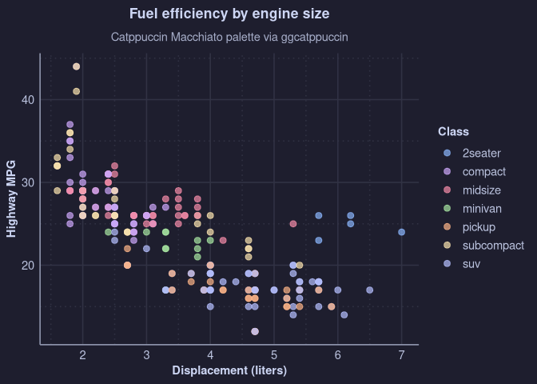
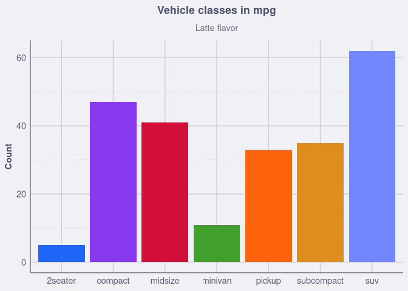
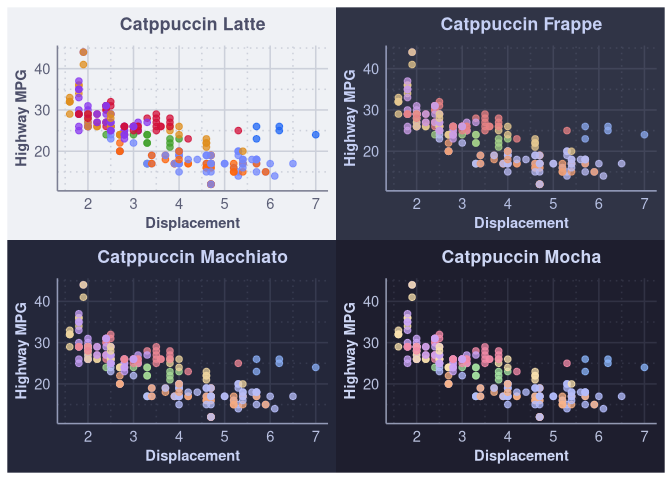

# ggcatppuccin

<!-- badges: start -->

[](https://github.com/ZhenyaKosovan/ggcatppuccin/actions/workflows/R-CMD-check.yaml)
[](https://codecov.io/gh/ZhenyaKosovan/ggcatppuccin?branch=main)
<!-- badges: end -->

Catppuccin palettes and a matching `ggplot2` theme for quickly styling
plots across four flavors: Latte, Frappe, Macchiato, and Mocha. Discrete
color and fill scales pair with `theme_catppuccin()` so backgrounds,
text, and grid lines stay coordinated.

## Installation

The package is not yet on CRAN; install the development version from
GitHub:

``` r
# install.packages("remotes")
remotes::install_github("ZhenyaKosovan/ggcatppuccin")
```

## Usage

Pick any flavor (default is `"mocha"`) and apply the theme plus the
color or fill scale. A helper lets you set the session-wide default
flavor if you want all plots to match.

``` r
library(ggplot2)
library(ggcatppuccin)

set_catppuccin_flavor("macchiato")

ggplot(mpg, aes(displ, hwy, color = class)) +
  geom_point(alpha = 0.7, size = 2.4) +
  scale_color_catppuccin() +
  theme_catppuccin() +
  labs(
    title = "Fuel efficiency by engine size",
    subtitle = "Catppuccin Macchiato palette via ggcatppuccin",
    x = "Displacement (liters)",
    y = "Highway MPG",
    color = "Class"
  )
```



Use `scale_fill_catppuccin()` with geoms that use fill aesthetics, and
switch flavors as needed:

``` r
ggplot(mpg, aes(class, fill = class)) +
  geom_bar() +
  scale_fill_catppuccin(flavor = "latte") +
  theme_catppuccin(flavor = "latte") +
  guides(fill = "none") +
  labs(
    title = "Vehicle classes in mpg",
    subtitle = "Latte flavor",
    x = NULL,
    y = "Count"
  )
```



The raw hex values are available in `catppuccin_flavors` if you need to
access individual colors directly.

## Helper geoms

`geom_catppuccin_point()` and `geom_catppuccin_col()` are small wrappers
around the standard geoms that default to Catppuccin accent colors:

``` r
ggplot(mtcars, aes(wt, mpg, color = factor(gear))) +
  geom_catppuccin_point(flavor = "macchiato") +
  scale_color_catppuccin("macchiato") +
  theme_catppuccin("macchiato")
```

## R Markdown / Quarto styling

Generate a CSS snippet for your document and point to it from YAML:

``` r
write_catppuccin_css("catppuccin.css", flavor = "latte")
```

``` yaml
format:
  html:
    css: catppuccin.css
```

## Flavors at a glance

``` r
library(patchwork)

flavors <- c("latte", "frappe", "macchiato", "mocha")

plot_flavor <- function(flavor) {
  ggplot(mpg, aes(displ, hwy, color = class)) +
    geom_point(size = 2, alpha = 0.75) +
    scale_color_catppuccin(flavor = flavor) +
    theme_catppuccin(flavor = flavor) +
    guides(color = "none") +
    labs(
      title = paste("Catppuccin", tools::toTitleCase(flavor)),
      x = "Displacement",
      y = "Highway MPG"
    )
}

plots <- lapply(flavors, plot_flavor)

# 2x2 grid of flavors
(plots[[1]] | plots[[2]]) /
  (plots[[3]] | plots[[4]])
```


