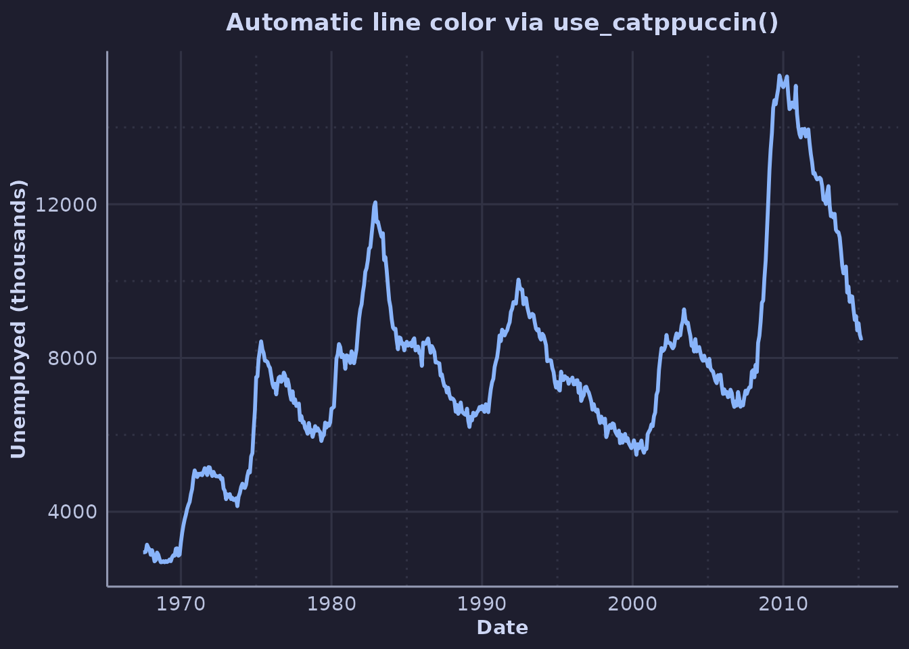
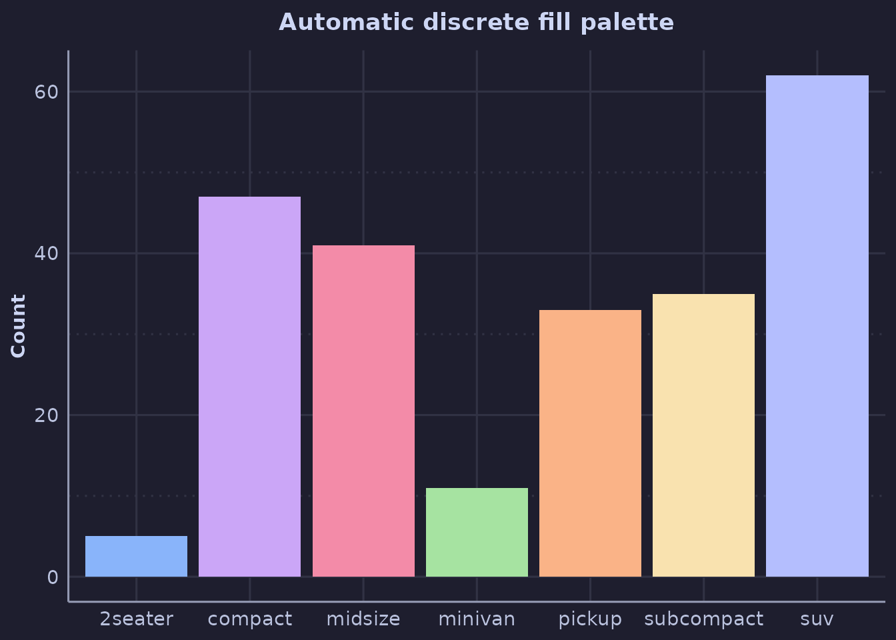

# Customizing Catppuccin Themes

``` r
library(ggplot2)
library(ggcatppuccin)

set_catppuccin_flavor("mocha")
```

## Theme Variants

ggcatppuccin provides three theme variants with different levels of
minimalism.

### Standard Theme

The standard
[`theme_catppuccin()`](https://zhenyakosovan.github.io/ggcatppuccin/reference/theme_catppuccin.md)
includes grid lines and full axis decoration:

``` r
ggplot(economics, aes(date, unemploy)) +
  geom_line(color = catppuccin_flavors$mocha$blue) +
  theme_catppuccin() +
  labs(
    title = "US Unemployment Over Time",
    x = "Date",
    y = "Unemployed (thousands)"
  )
```


### Minimal Theme

[`theme_catppuccin_minimal()`](https://zhenyakosovan.github.io/ggcatppuccin/reference/theme_catppuccin_minimal.md)
removes grid lines by default, with optional control:

``` r
ggplot(mpg, aes(displ, hwy)) +
  geom_point(color = catppuccin_flavors$mocha$mauve, size = 2) +
  theme_catppuccin_minimal() +
  labs(
    title = "Minimal Theme - No Grid",
    x = "Displacement",
    y = "Highway MPG"
  )
```


Add major grid lines:

``` r
ggplot(mpg, aes(displ, hwy)) +
  geom_point(color = catppuccin_flavors$mocha$mauve, size = 2) +
  theme_catppuccin_minimal(grid = "major") +
  labs(
    title = "Minimal Theme - Major Grid",
    x = "Displacement",
    y = "Highway MPG"
  )
```


### Void Theme

[`theme_catppuccin_void()`](https://zhenyakosovan.github.io/ggcatppuccin/reference/theme_catppuccin_void.md)
removes all axes and grid, perfect for maps or heatmaps:

``` r
ggplot(faithfuld, aes(waiting, eruptions, fill = density)) +
  geom_tile() +
  scale_fill_catppuccin_c() +
  theme_catppuccin_void() +
  labs(title = "Old Faithful Density")
```


## Advanced Scales

### Sequential Scales

Sequential scales go from a base color to an accent:

``` r
df <- expand.grid(x = 1:10, y = 1:10)
df$z <- df$x + df$y

ggplot(df, aes(x, y, fill = z)) +
  geom_tile() +
  scale_fill_catppuccin_sequential(accent = "green") +
  theme_catppuccin_minimal() +
  labs(title = "Sequential Scale - Base to Green")
```


Try different accents:

``` r
colors <- c("blue", "mauve", "peach")
plots <- lapply(colors, function(col) {
  ggplot(df, aes(x, y, fill = z)) +
    geom_tile() +
    scale_fill_catppuccin_sequential(accent = col) +
    theme_catppuccin_void() +
    labs(title = col)
})

if (requireNamespace("patchwork", quietly = TRUE)) {
  patchwork::wrap_plots(plots, nrow = 1)
}
```


### Diverging Scales

Diverging scales use two accent colors with a neutral midpoint:

``` r
df$z_centered <- df$z - mean(df$z)

ggplot(df, aes(x, y, fill = z_centered)) +
  geom_tile() +
  scale_fill_catppuccin_diverging(low_color = "blue", high_color = "red") +
  theme_catppuccin_minimal() +
  labs(
    title = "Diverging Scale",
    subtitle = "Blue (low) to Red (high) through base color"
  )
```


## Working with Palette Colors

Extract specific colors for custom use:

``` r
# Get specific colors
my_colors <- unname(unlist(catppuccin_flavors$mocha[c("blue", "red", "green")]))
print(my_colors)
#> [1] "#89b4fa" "#f38ba8" "#a6e3a1"

# Use in a plot
ggplot(iris, aes(Sepal.Length, Sepal.Width, color = Species)) +
  geom_point(size = 3) +
  scale_color_manual(values = my_colors) +
  theme_catppuccin() +
  labs(title = "Custom Color Selection")
```


## Visualizing Palettes

See all colors in a flavor:

``` r
show_catppuccin_palette("mocha", type = "accents")
```


Compare all flavors:

``` r
compare_flavors(type = "accents")
```


## Modifying Themes

You can further customize themes using standard ggplot2 theme
modifications:

``` r
ggplot(mpg, aes(class, hwy, fill = class)) +
  geom_boxplot() +
  scale_fill_catppuccin() +
  theme_catppuccin() +
  theme(
    legend.position = "none",
    axis.text.x = element_text(angle = 45, hjust = 1),
    plot.title.position = "plot"
  ) +
  labs(
    title = "Highway MPG by Class",
    subtitle = "With custom theme modifications",
    x = NULL,
    y = "Highway MPG"
  )
```


## Session-Wide Defaults with `use_catppuccin()`

Instead of adding
[`scale_color_catppuccin()`](https://zhenyakosovan.github.io/ggcatppuccin/reference/scale_color_catppuccin.md)
to many plots, you can activate Catppuccin colors globally.
[`use_catppuccin()`](https://zhenyakosovan.github.io/ggcatppuccin/reference/use_catppuccin.md)
updates the default colors for common geoms (point, line, bar, col,
boxplot, violin) and sets the default discrete color/fill scales:

``` r
use_catppuccin("mocha")

# geom_line() now uses Catppuccin blue by default:
ggplot(economics, aes(date, unemploy)) +
  geom_line(linewidth = 1) +
  theme_catppuccin() +
  labs(
    title = "Automatic line color via use_catppuccin()",
    x = "Date",
    y = "Unemployed (thousands)"
  )
```



``` r

# Mapped discrete aesthetics also pick up the Catppuccin palette:
ggplot(mpg, aes(class, fill = class)) +
  geom_bar() +
  theme_catppuccin() +
  guides(fill = "none") +
  labs(
    title = "Automatic discrete fill palette",
    x = NULL,
    y = "Count"
  )
```



Switch flavors mid-session by calling
[`use_catppuccin()`](https://zhenyakosovan.github.io/ggcatppuccin/reference/use_catppuccin.md)
again with a different flavor. When you’re done, restore ggplot2
defaults:

``` r
reset_catppuccin()
```

## Combining Multiple Aesthetics

``` r
ggplot(mtcars, aes(wt, mpg, color = factor(cyl), size = hp)) +
  geom_point(alpha = 0.7) +
  scale_color_catppuccin() +
  theme_catppuccin() +
  labs(
    title = "Multiple Aesthetics",
    x = "Weight (1000 lbs)",
    y = "Miles per Gallon",
    color = "Cylinders",
    size = "Horsepower"
  )
```


