# Gallery of Examples

``` r
library(ggplot2)
library(ggcatppuccin)
```

This gallery showcases various plot types using ggcatppuccin across
different flavors.

## Scatter Plots

``` r
set_catppuccin_flavor("mocha")

ggplot(iris, aes(Sepal.Length, Sepal.Width, color = Species)) +
  geom_point(size = 3, alpha = 0.7) +
  scale_color_catppuccin() +
  theme_catppuccin() +
  labs(
    title = "Iris Sepal Measurements",
    subtitle = "Mocha flavor",
    x = "Sepal Length (cm)",
    y = "Sepal Width (cm)"
  )
```

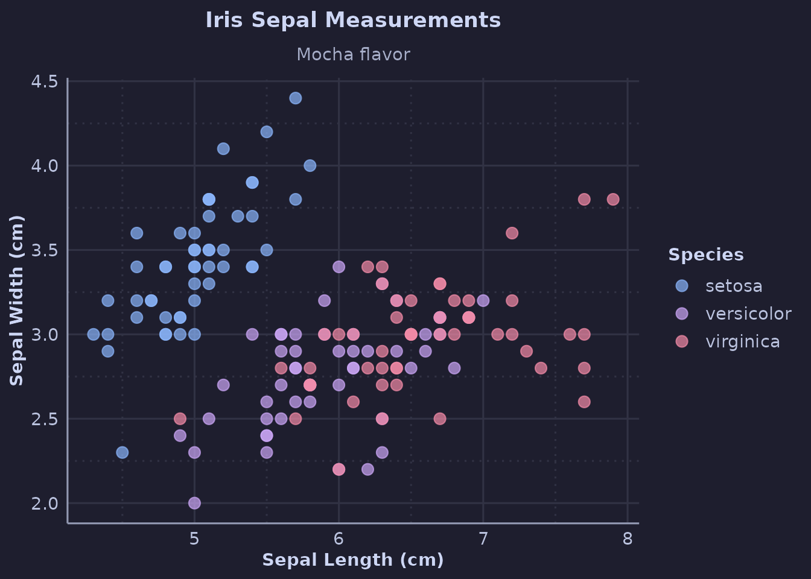

## Line Plots

``` r
set_catppuccin_flavor("frappe")

ggplot(economics, aes(date, unemploy / 1000)) +
  geom_line(color = catppuccin_palette("frappe", "blue"), linewidth = 1) +
  theme_catppuccin() +
  labs(
    title = "US Unemployment Rate",
    subtitle = "Frappé flavor",
    x = NULL,
    y = "Unemployed (millions)"
  )
```

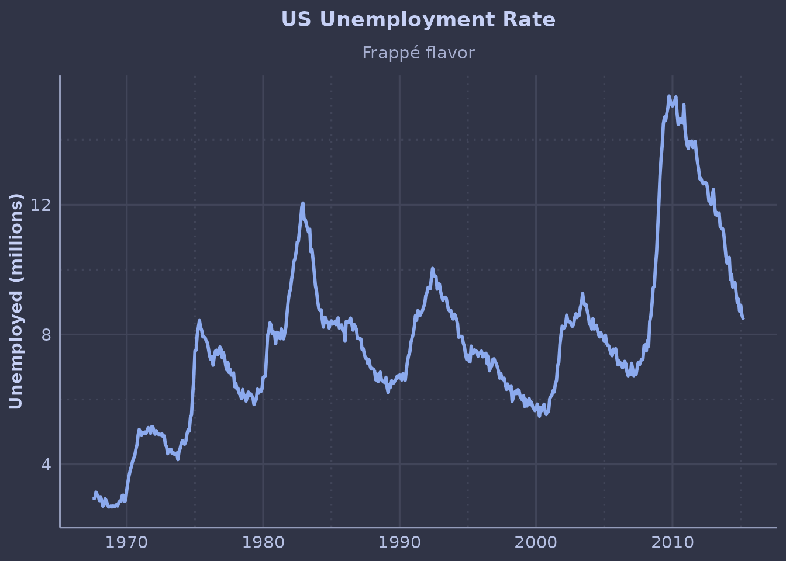

## Bar Charts

``` r
set_catppuccin_flavor("latte")

ggplot(mpg, aes(class, fill = class)) +
  geom_bar() +
  scale_fill_catppuccin() +
  theme_catppuccin() +
  guides(fill = "none") +
  labs(
    title = "Vehicle Count by Class",
    subtitle = "Latte flavor",
    x = NULL,
    y = "Count"
  ) +
  theme(axis.text.x = element_text(angle = 45, hjust = 1))
```

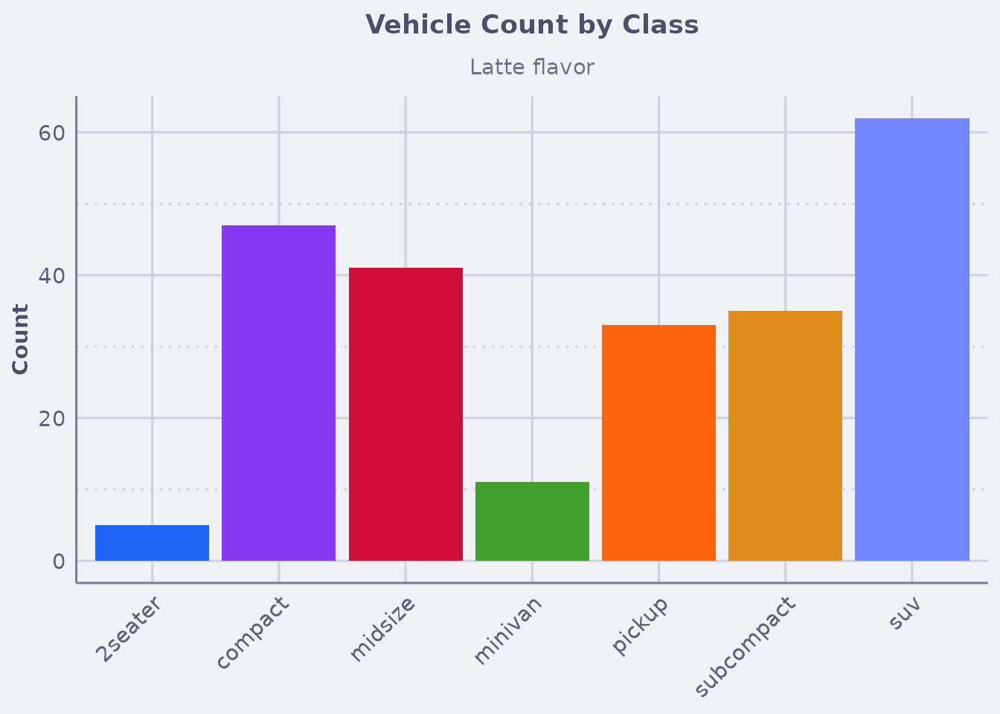

## Boxplots

``` r
set_catppuccin_flavor("macchiato")

ggplot(mpg, aes(class, hwy, fill = class)) +
  geom_catppuccin_boxplot() +
  scale_fill_catppuccin() +
  theme_catppuccin() +
  guides(fill = "none") +
  labs(
    title = "Highway MPG Distribution by Class",
    subtitle = "Macchiato flavor",
    x = NULL,
    y = "Highway MPG"
  ) +
  theme(axis.text.x = element_text(angle = 45, hjust = 1))
```

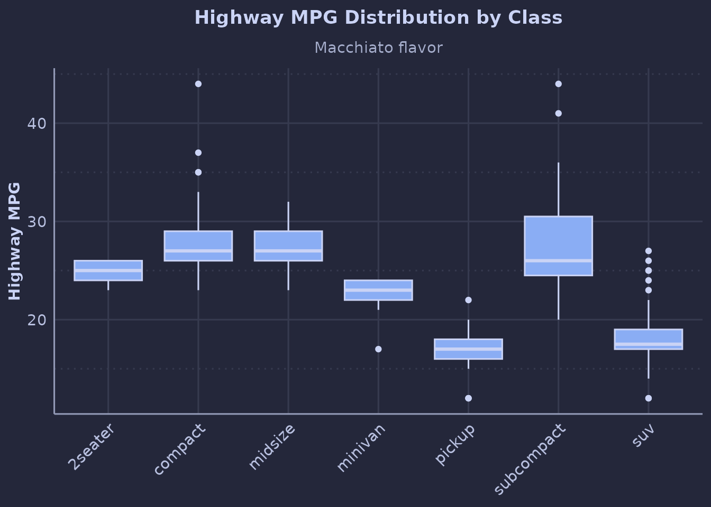

## Violin Plots

``` r
set_catppuccin_flavor("mocha")

ggplot(diamonds[sample(nrow(diamonds), 1000), ], aes(cut, price, fill = cut)) +
  geom_catppuccin_violin() +
  scale_fill_catppuccin() +
  scale_y_log10() +
  theme_catppuccin() +
  guides(fill = "none") +
  labs(
    title = "Diamond Price Distribution by Cut",
    subtitle = "Mocha flavor, log scale",
    x = "Cut Quality",
    y = "Price (log scale)"
  )
```

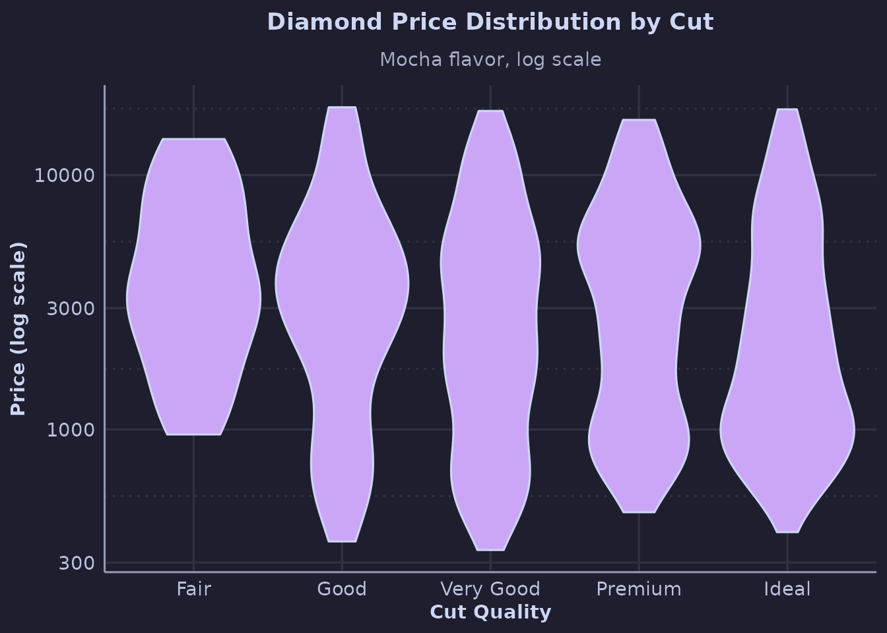

## Heatmaps

``` r
set_catppuccin_flavor("frappe")

ggplot(faithfuld, aes(waiting, eruptions, fill = density)) +
  geom_tile() +
  scale_fill_catppuccin_c() +
  theme_catppuccin_minimal() +
  labs(
    title = "Old Faithful Eruption Patterns",
    subtitle = "Frappé flavor with continuous scale",
    x = "Waiting Time (min)",
    y = "Eruption Duration (min)",
    fill = "Density"
  )
```

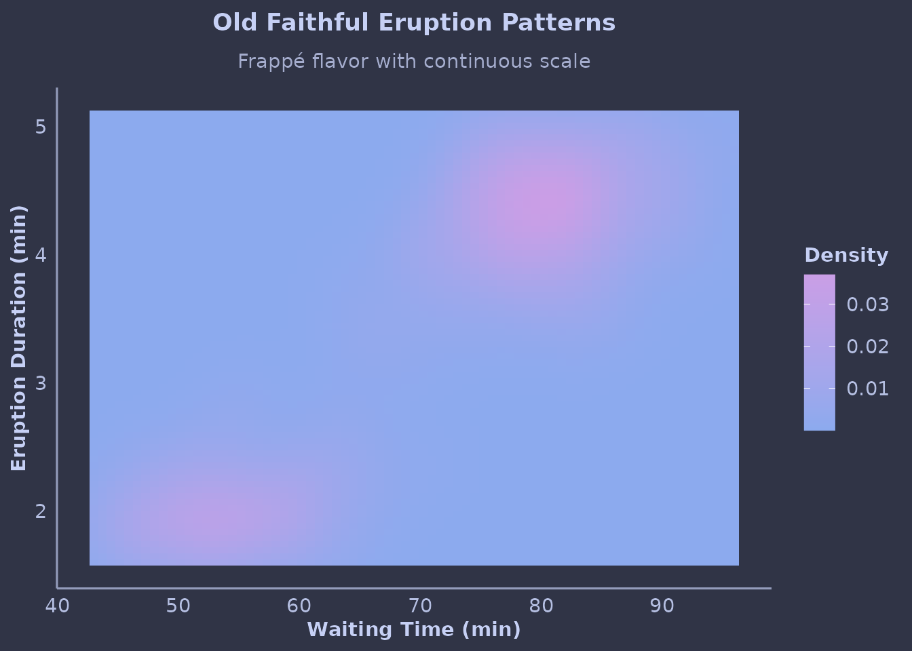

## Diverging Scale

``` r
set_catppuccin_flavor("mocha")

df <- data.frame(
  x = rep(1:10, 10),
  y = rep(1:10, each = 10)
)
df$z <- (df$x - 5.5) * (df$y - 5.5)

ggplot(df, aes(x, y, fill = z)) +
  geom_tile() +
  scale_fill_catppuccin_diverging() +
  theme_catppuccin_void() +
  labs(
    title = "Diverging Color Scale",
    subtitle = "Mocha flavor",
    fill = "Value"
  )
```

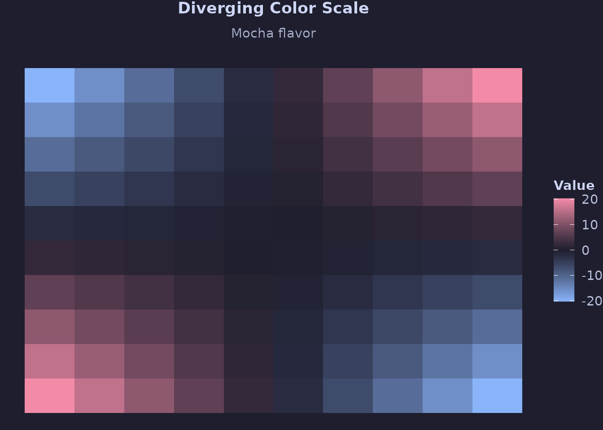

## Faceted Plots

``` r
set_catppuccin_flavor("latte")

ggplot(mpg, aes(displ, hwy, color = class)) +
  geom_point(alpha = 0.7) +
  facet_wrap(~ year) +
  scale_color_catppuccin() +
  theme_catppuccin() +
  labs(
    title = "Fuel Efficiency by Year",
    subtitle = "Latte flavor with facets",
    x = "Displacement (L)",
    y = "Highway MPG"
  )
```

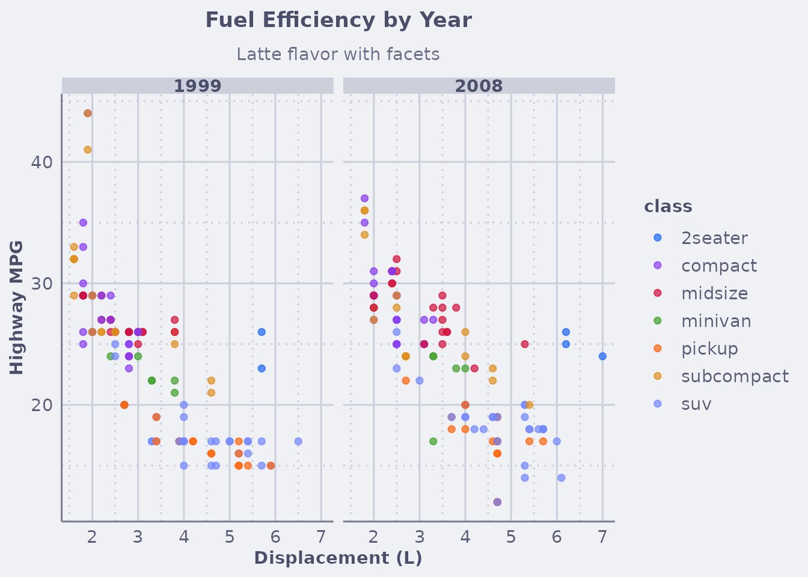

## Stacked Bar Chart

``` r
set_catppuccin_flavor("macchiato")

ggplot(mpg, aes(manufacturer, fill = class)) +
  geom_bar() +
  scale_fill_catppuccin() +
  theme_catppuccin() +
  labs(
    title = "Vehicle Classes by Manufacturer",
    subtitle = "Macchiato flavor",
    x = NULL,
    y = "Count",
    fill = "Class"
  ) +
  theme(axis.text.x = element_text(angle = 45, hjust = 1))
```

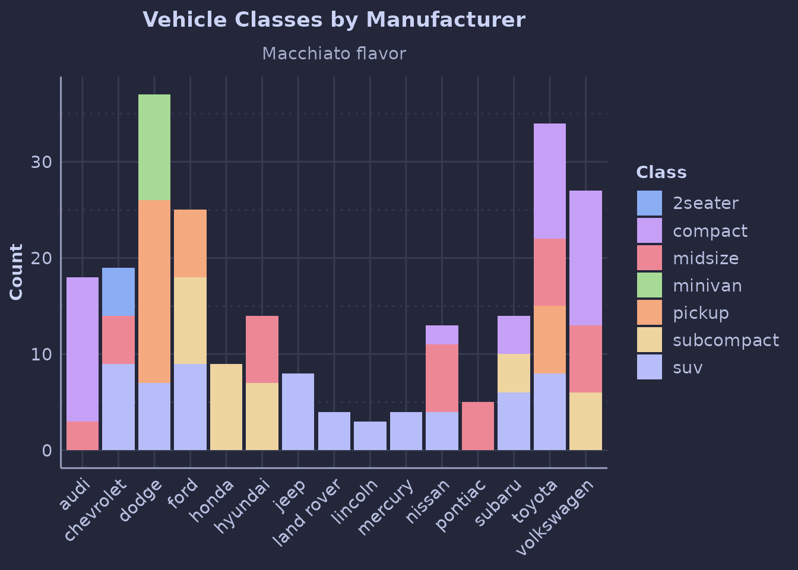

## Density Plot

``` r
set_catppuccin_flavor("frappe")

ggplot(diamonds, aes(price, fill = cut)) +
  geom_density(alpha = 0.6) +
  scale_fill_catppuccin() +
  scale_x_log10() +
  theme_catppuccin() +
  labs(
    title = "Diamond Price Density by Cut",
    subtitle = "Frappé flavor",
    x = "Price (log scale)",
    y = "Density",
    fill = "Cut"
  )
```

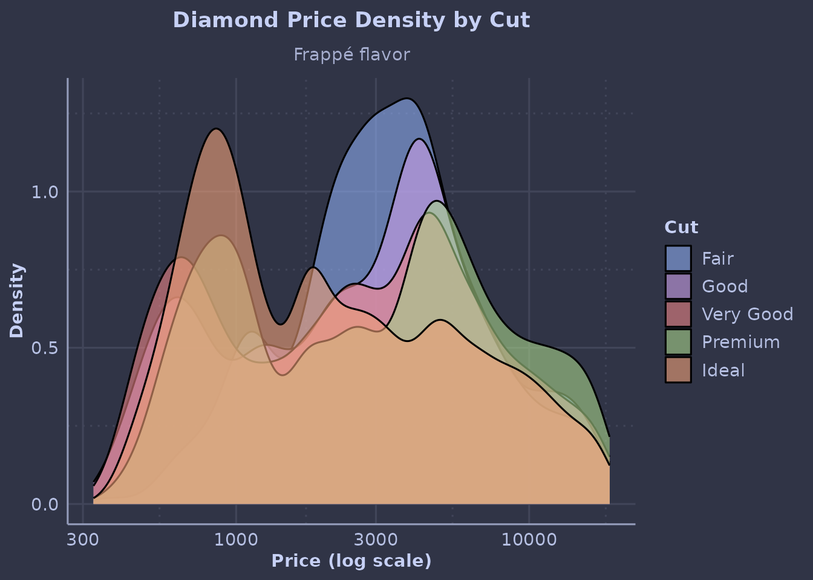

## Multiple Geoms

``` r
set_catppuccin_flavor("mocha")

ggplot(mpg, aes(class, hwy)) +
  geom_catppuccin_boxplot(alpha = 0.5) +
  geom_jitter(width = 0.2, alpha = 0.3,
              color = catppuccin_palette("mocha", "peach")) +
  theme_catppuccin() +
  labs(
    title = "Highway MPG with Box and Points",
    subtitle = "Mocha flavor, multiple geoms",
    x = NULL,
    y = "Highway MPG"
  ) +
  theme(axis.text.x = element_text(angle = 45, hjust = 1))
```

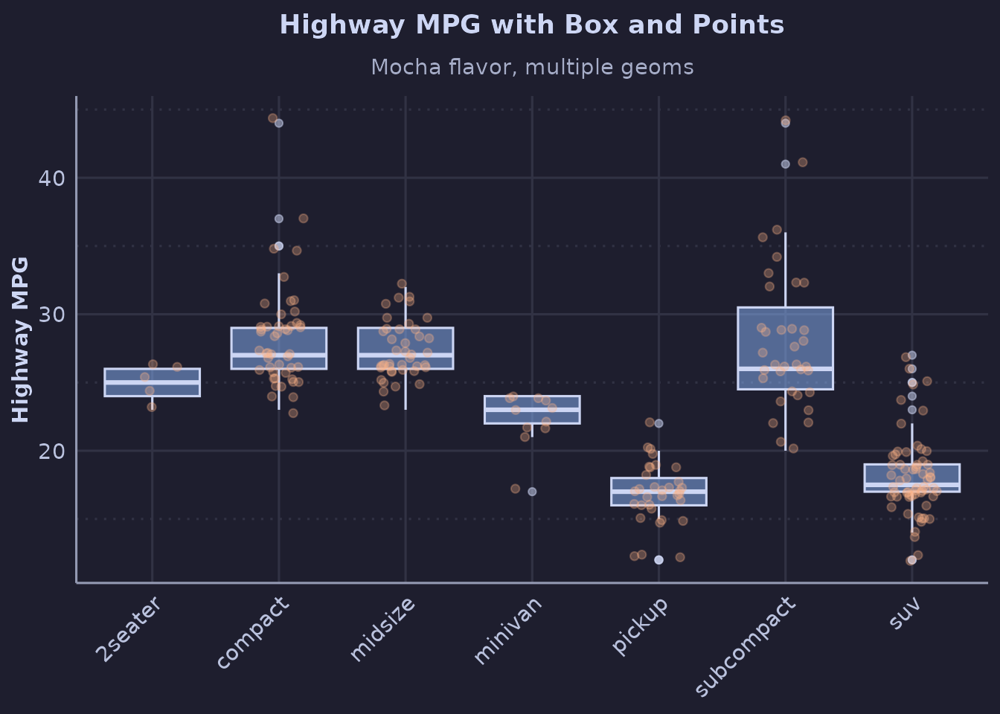

## Automatic Styling with `use_catppuccin()`

With
[`use_catppuccin()`](https://zhenyakosovan.github.io/ggcatppuccin/reference/use_catppuccin.md),
many plain ggplot2 plots pick up Catppuccin defaults automatically
(common geoms plus discrete color/fill scales):

``` r
use_catppuccin("mocha")

# No explicit scale needed here: color is discrete and geom_point() is supported
ggplot(iris, aes(Sepal.Length, Sepal.Width, color = Species)) +
  geom_point(size = 3, alpha = 0.7) +
  theme_catppuccin() +
  labs(
    title = "Automatic Color Palette",
    subtitle = "Via use_catppuccin() defaults for discrete color mapping"
  )
```

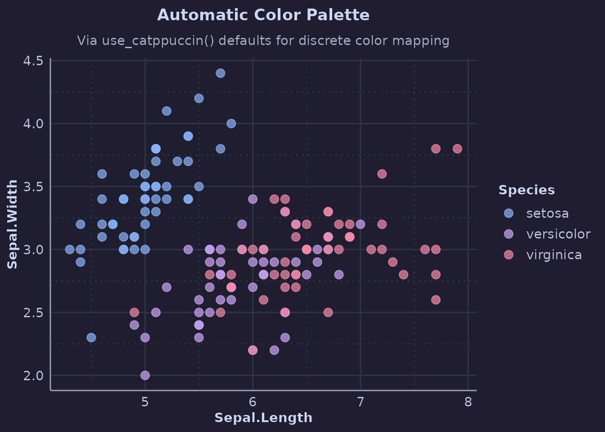

``` r

reset_catppuccin()
```

## All Four Flavors

Compare the same plot across all flavors:

``` r
make_plot <- function(flavor) {
  set_catppuccin_flavor(flavor)
  ggplot(iris, aes(Sepal.Length, Sepal.Width, color = Species)) +
    geom_point(size = 2, alpha = 0.7) +
    scale_color_catppuccin() +
    theme_catppuccin_minimal() +
    labs(title = tools::toTitleCase(flavor)) +
    guides(color = "none")
}

if (requireNamespace("patchwork", quietly = TRUE)) {
  plots <- lapply(c("latte", "frappe", "macchiato", "mocha"), make_plot)
  patchwork::wrap_plots(plots, ncol = 2)
}
```

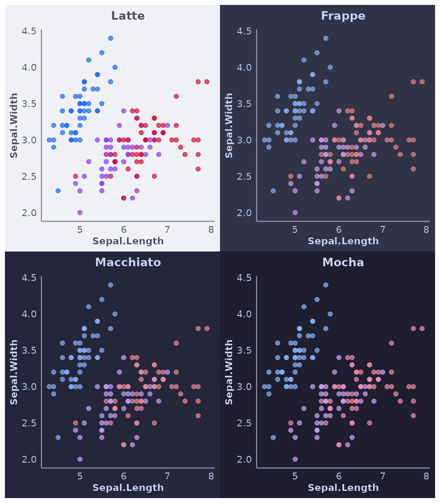
